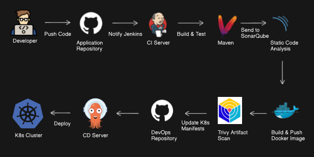

# End to end CI/CD Pipeline
Pipeline Breakdown are given below: 
+ Developed a CI pipeline that triggers automatically upon new release to the application repository.
+ Initiating Jenkins jobs to perform build and test using Maven.
+ Integrated SonarQube for static code analysis to ensure code quality and enforce coding standards.
+ Used Docker to build and push application images after passing Trivy scan to a container registry for artifact security validation.
+ Managed Kubernetes manifests in a dedicated DevOps repository, automatically updated by the pipeline post-image build.
+ Enabled continuous deployment via a CD pipeline using Argo CD to a Kubernetes cluster, ensuring safe and repeatable roll outs.
+ Achieved full pipeline automation, improving delivery speed, security, and reliability across the SDLC.

## This is a java application. It demonstrate a complete continous integration and continous delivery/deployment Pipeline
